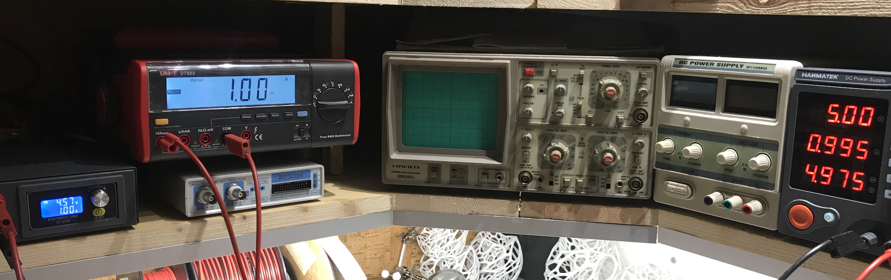
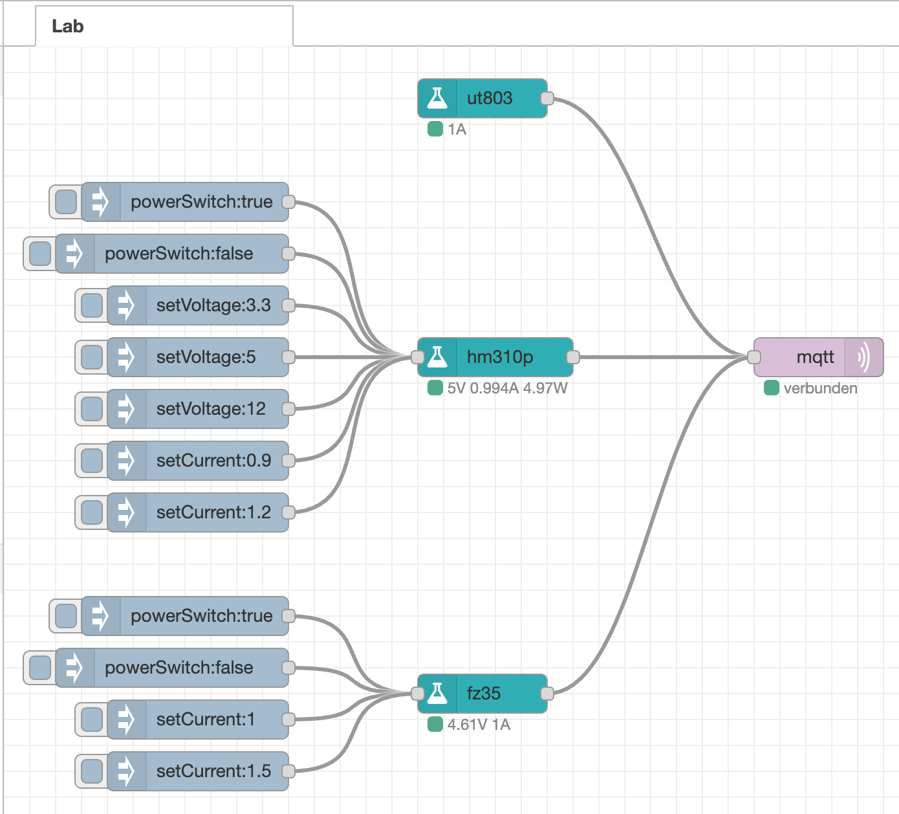

# node-red-contrib-lab

> Node-RED nodes to interact with laboratory equipment

## Supported devices

* Multi Meter [UNI-T UT803](https://www.uni-trend.com/html/product/gongye/hdso/UT800_Series/UT803.html) (only via RS232, USB is _not_ supported, maybe other UNI-T DMMs will work too)
* DC Power Supply [Hanmatek HM310P](https://www.amazon.de/HANMATEK-Labornetzger%C3%A4t-Stabilisiertes-Schaltnetzteil-Kurzschlussfest/dp/B07YB1DQZ8) (most likely compatible with HM305P also)
* Electronic Load [XY-FZ35](https://de.aliexpress.com/item/32953589108.html)

## License

Copyright (c) Sebastian Raff <hobbyquaker@gmail.com>
